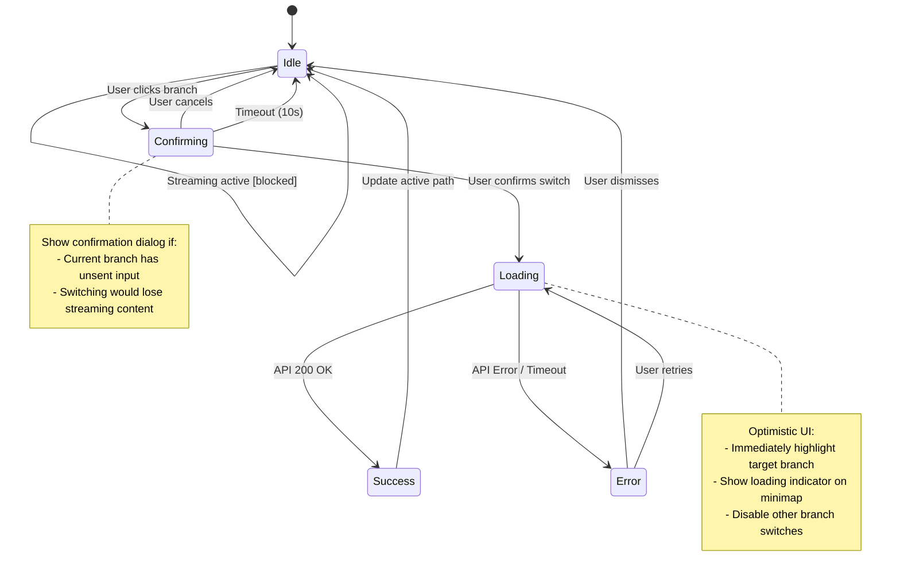
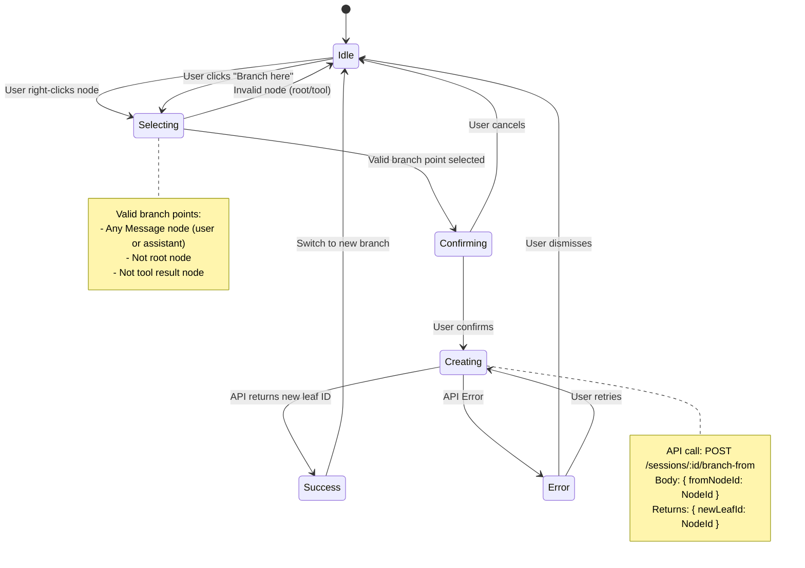
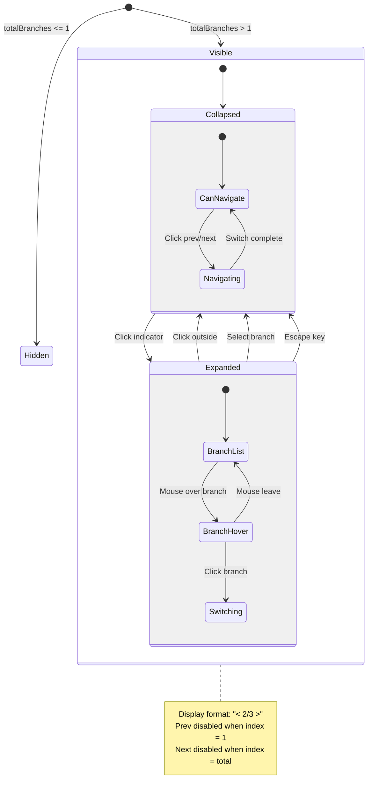

# BranchHistoryNavigator Component Specification

> **Component Type:** Organism
> **Responsibility:** Manage tree-based conversation history with branch visualization, active leaf navigation, and enhanced message card integration.
> **Product Area:** Chat Interface
> **User Role:** End User (conversational AI interaction)

---

## 1. Component Contract

### 1.1 Core Data Types

```typescript
// Re-export from backend.ts for consistency
type NodeId = string;      // ULID format
type SessionId = string;   // ULID format

// Branch metadata returned from backend
interface BranchInfo {
  // [Controlled] Unique identifier for the leaf node
  leafId: NodeId;
  // [Computed] Number of messages in this branch path
  depth: number;
  // [Computed] Preview of the last message content (truncated)
  preview: string;
  // [Computed] Role of the last message (user/assistant)
  lastRole: 'user' | 'assistant' | 'system' | 'tool';
  // [Computed] Timestamp of the last message
  lastUpdated: Date;
  // [Computed] Whether this is the currently active branch
  isActive: boolean;
  // [Computed] Node ID where this branch diverged from main path
  branchPointId: NodeId | null;
}

// Node with branch context for display
interface BranchNode extends TreeNode {
  // [Computed] All sibling branches at this point
  siblingBranches: BranchInfo[];
  // [Computed] Whether this node has alternative branches
  hasBranches: boolean;
  // [Computed] Index of current branch among siblings (0-based)
  branchIndex: number;
  // [Computed] Total number of branches at this point
  totalBranches: number;
}
```

### 1.2 BranchHistoryNavigator Props

```typescript
interface BranchHistoryNavigatorProps {
  // [Controlled] Current session identifier
  sessionId: SessionId;

  // [Controlled] All nodes in the session tree
  nodes: Map<NodeId, Node>;

  // [Controlled] Currently active leaf node
  activeLeafId: NodeId | null;

  // [Controlled] Path from root to active leaf (ordered)
  activePath: NodeId[];

  // [Controlled] Checkpoints on the active path
  checkpoints: Map<NodeId, CheckpointData>;

  // [Controlled] All available branches in session
  branches: BranchInfo[];

  // [Controlled] Whether the session is currently streaming
  isStreaming: boolean;

  // [Local] Currently selected node for inspection
  selectedNodeId?: NodeId | null;

  // [Local] Whether the minimap panel is expanded
  minimapExpanded?: boolean;

  // [Local] Whether to show inactive branches in minimap
  showInactiveBranches?: boolean;
}
```

### 1.3 BranchHistoryNavigator State

```typescript
interface BranchHistoryNavigatorState {
  // [Local] Node currently being hovered for preview
  hoveredNodeId: NodeId | null;

  // [Local] Branch switch operation in progress
  switchingBranch: {
    targetLeafId: NodeId;
    status: 'pending' | 'loading' | 'success' | 'error';
    error?: string;
  } | null;

  // [Local] Branch creation operation in progress
  creatingBranch: {
    fromNodeId: NodeId;
    status: 'pending' | 'confirming' | 'loading' | 'success' | 'error';
    error?: string;
  } | null;

  // [Local] Minimap viewport state
  minimapViewport: {
    scrollX: number;
    scrollY: number;
    zoom: number;
  };

  // [Local] Branch selector dropdown state per node
  openBranchSelectors: Set<NodeId>;

  // [Local] Expanded checkpoint nodes (showing full summary)
  expandedCheckpoints: Set<NodeId>;
}
```

### 1.4 BranchHistoryNavigator Events

```typescript
interface BranchHistoryNavigatorEvents {
  // Emitted when user requests to switch to a different branch
  onBranchSwitch: (targetLeafId: NodeId) => Promise<void>;

  // Emitted when user requests to create a new branch from a node
  onBranchCreate: (fromNodeId: NodeId, initialMessage?: string) => Promise<NodeId>;

  // Emitted when user selects a node for inspection
  onNodeSelect: (nodeId: NodeId | null) => void;

  // Emitted when user requests to scroll chat to a specific node
  onScrollToNode: (nodeId: NodeId) => void;

  // Emitted when minimap expansion state changes
  onMinimapToggle: (expanded: boolean) => void;

  // Emitted when user expands/collapses a checkpoint
  onCheckpointToggle: (nodeId: NodeId, expanded: boolean) => void;

  // Emitted when user requests to delete a branch (destructive)
  onBranchDelete?: (leafId: NodeId) => Promise<void>;
}
```

---

### 1.5 Enhanced MessageCard Props (Extension)

```typescript
interface EnhancedMessageCardProps extends MessageCardProps {
  // [Computed] Branch context for this message
  branchContext?: {
    // Whether this node is a branch point (has multiple children)
    isBranchPoint: boolean;
    // Available branches at this point
    branches: BranchInfo[];
    // Current branch index (1-based for display)
    currentBranchIndex: number;
    // Total branches at this point
    totalBranches: number;
  };

  // [Computed] Whether this node has a checkpoint
  hasCheckpoint: boolean;

  // [Local] Whether checkpoint summary is expanded
  checkpointExpanded?: boolean;

  // [Controlled] Checkpoint data if present
  checkpoint?: CheckpointData;

  // Event: User navigates to previous/next branch
  onBranchNavigate?: (direction: 'prev' | 'next') => void;

  // Event: User opens branch selector dropdown
  onBranchSelectorOpen?: () => void;

  // Event: User toggles checkpoint expansion
  onCheckpointToggle?: (expanded: boolean) => void;
}
```

---

### 1.6 BranchIndicator Sub-Component

```typescript
interface BranchIndicatorProps {
  // [Computed] Current branch index (1-based)
  currentIndex: number;

  // [Computed] Total number of branches
  totalBranches: number;

  // [Computed] Preview info for adjacent branches
  prevBranch?: BranchInfo;
  nextBranch?: BranchInfo;

  // [Local] Whether dropdown is open
  isOpen: boolean;

  // [Controlled] All branches at this point
  branches: BranchInfo[];

  // [Controlled] Whether navigation is disabled (during streaming)
  disabled: boolean;
}

interface BranchIndicatorEvents {
  onPrev: () => void;
  onNext: () => void;
  onToggleDropdown: () => void;
  onSelectBranch: (leafId: NodeId) => void;
}
```

---

### 1.7 MinimapPanel Sub-Component (Enhanced)

```typescript
interface MinimapPanelProps {
  // [Controlled] Positioned nodes for rendering
  positionedNodes: PositionedNode[];

  // [Controlled] Active leaf ID
  activeLeafId: NodeId | null;

  // [Local] Currently selected node
  selectedNodeId: NodeId | null;

  // [Local] Whether to show inactive branches
  showInactive: boolean;

  // [Local] Current zoom level (0.5 - 2.0)
  zoom: number;

  // [Controlled] Branch info for each leaf
  branches: Map<NodeId, BranchInfo>;

  // [Computed] Nodes that are branch points
  branchPoints: Set<NodeId>;
}

interface MinimapPanelEvents {
  onNodeSelect: (nodeId: NodeId) => void;
  onNodeDoubleClick: (nodeId: NodeId) => void;  // Switch branch
  onZoomChange: (zoom: number) => void;
  onToggleInactive: (show: boolean) => void;
  onCenterView: () => void;
}
```

---

## 2. State Logic

### 2.1 Branch Switch State Machine



### 2.2 Branch Creation State Machine



### 2.3 Message Card Branch Navigation



### 2.4 Minimap Interaction State

```mermaid
stateDiagram-v2
    [*] --> Idle

    state Idle {
        [*] --> Default
        Default --> NodeHover: Mouse enter node
        NodeHover --> Default: Mouse leave
    }

    NodeHover --> NodeSelected: Single click
    NodeHover --> BranchSwitching: Double click

    NodeSelected --> Idle: Click empty space
    NodeSelected --> NodeHover: Hover different node
    NodeSelected --> MessageScrolling: Click "Go to message"

    BranchSwitching --> Idle: Switch complete
    BranchSwitching --> Error: Switch failed

    MessageScrolling --> Idle: Scroll complete

    state Zooming {
        [*] --> ZoomIdle
        ZoomIdle --> ZoomIn: Ctrl + Scroll up
        ZoomIdle --> ZoomOut: Ctrl + Scroll down
        ZoomIn --> ZoomIdle: Release
        ZoomOut --> ZoomIdle: Release
    }

    state Panning {
        [*] --> PanIdle
        PanIdle --> Panning: Middle mouse drag
        Panning --> PanIdle: Release
    }

    note right of NodeHover
        Show tooltip with:
        - Role icon
        - Content preview (100 chars)
        - Timestamp
        - Branch count (if > 1)
    end note
```

---

## 3. Behavioral Scenarios

### 3.1 Branch Switching Scenarios

- **Scenario: Switch to sibling branch via message card**
  - **Given** a message card showing "2/3" branch indicator
  - **When** user clicks the "next" arrow (→)
  - **Then** the system should:
    1. Emit `onBranchSwitch` with the next sibling's leaf ID
    2. Update `activeLeafId` to the new branch
    3. Animate the message list transition (fade out old, fade in new)
    4. Update minimap to highlight new active path
    5. Preserve scroll position relative to the branch point

- **Scenario: Switch branch during active streaming**
  - **Given** the assistant is currently streaming a response
  - **When** user attempts to switch branches
  - **Then** the system should:
    1. Show a confirmation dialog: "Switching branches will stop the current response. Continue?"
    2. If confirmed: abort streaming, switch branch, clear pending content
    3. If cancelled: keep current branch and continue streaming

- **Scenario: Switch to branch via minimap double-click**
  - **Given** the minimap shows multiple branches
  - **When** user double-clicks a leaf node on an inactive branch
  - **Then** the system should:
    1. Immediately highlight the target branch path
    2. Show loading indicator on the target node
    3. Call `onBranchSwitch` and await completion
    4. Scroll chat to show the divergence point
    5. Remove loading indicator and finalize highlighting

- **Scenario: Network timeout during branch switch**
  - **Given** user initiated a branch switch
  - **When** the API call takes longer than 10 seconds
  - **Then** the system should:
    1. Revert optimistic UI changes
    2. Show error toast: "Branch switch timed out. Please try again."
    3. Re-enable branch switching controls
    4. Keep user on the original branch

### 3.2 Branch Creation Scenarios

- **Scenario: Create new branch from assistant message**
  - **Given** user is viewing a conversation with assistant responses
  - **When** user right-clicks an assistant message and selects "Branch from here"
  - **Then** the system should:
    1. Show confirmation: "Create a new conversation branch from this point?"
    2. On confirm: call `onBranchCreate(nodeId)`
    3. Show loading state on the source message
    4. On success: automatically switch to the new branch
    5. Focus the input field for the user's new message

- **Scenario: Attempt to branch from invalid node**
  - **Given** user is viewing the conversation tree
  - **When** user tries to branch from a tool result node
  - **Then** the system should:
    1. Disable the "Branch from here" option
    2. Show tooltip: "Cannot branch from tool results. Select a message instead."

- **Scenario: Create branch with unsaved input**
  - **Given** user has typed a message in the input field (not sent)
  - **When** user creates a new branch from an earlier point
  - **Then** the system should:
    1. Show warning: "You have unsent text. Create branch anyway?"
    2. If confirmed: preserve the unsent text in localStorage, create branch
    3. If cancelled: abort branch creation

### 3.3 Message Card Enhancement Scenarios

- **Scenario: Display branch indicator on branch points**
  - **Given** a message node that has 3 child branches
  - **When** the message card renders
  - **Then** the system should:
    1. Show branch indicator in the card header: "< 1/3 >"
    2. Left arrow disabled (already on first branch)
    3. Right arrow enabled
    4. Clicking indicator opens branch dropdown

- **Scenario: Branch dropdown shows preview info**
  - **Given** a message with 3 branches, dropdown is open
  - **When** user views the dropdown
  - **Then** each branch option should show:
    1. Branch number (1, 2, 3)
    2. Preview of the last message (truncated to 50 chars)
    3. Timestamp of last activity
    4. Visual indicator for currently active branch
    5. Different background for branch being hovered

- **Scenario: Checkpoint indicator on message**
  - **Given** a message node that has checkpoint data
  - **When** the message card renders
  - **Then** the system should:
    1. Show checkpoint badge icon (bookmark/flag)
    2. On hover: show tooltip with checkpoint summary preview
    3. On click: expand to show full checkpoint summary inline
    4. Show stats: "Summarized 15 messages, 12.5k tokens → 800 tokens"

### 3.4 Minimap Enhancement Scenarios

- **Scenario: Visualize branch points distinctly**
  - **Given** the minimap is rendering the tree
  - **When** a node has multiple children (branch point)
  - **Then** the node should:
    1. Display a special "fork" icon or double-ring indicator
    2. Show branch count badge (e.g., "3" for 3 branches)
    3. Highlight all child edges on hover

- **Scenario: Collapse deep inactive branches**
  - **Given** an inactive branch that is 8 levels deep
  - **When** "Show inactive branches" is OFF
  - **Then** the system should:
    1. Collapse the branch after depth 5
    2. Show a "+3" badge indicating hidden nodes
    3. Expand on hover to preview the full branch
    4. Click expands the branch permanently (for this session)

- **Scenario: Sync minimap selection with chat scroll**
  - **Given** user is scrolling through a long conversation
  - **When** a message scrolls into the viewport center
  - **Then** the minimap should:
    1. Highlight the corresponding node
    2. Auto-pan to keep the highlighted node visible
    3. Not steal focus or interrupt user interaction

- **Scenario: Navigate from minimap to message**
  - **Given** user has selected a node in the minimap
  - **When** user single-clicks the node (or presses Enter)
  - **Then** the system should:
    1. Scroll the chat to center that message
    2. Briefly pulse/highlight the message card
    3. Keep the minimap node selected

### 3.5 Error Handling Scenarios

- **Scenario: Branch data out of sync**
  - **Given** the client's branch data is stale (another tab made changes)
  - **When** user attempts to switch to a branch that no longer exists
  - **Then** the system should:
    1. Show error: "This branch is no longer available"
    2. Trigger a full session refresh
    3. Update the minimap and branch indicators
    4. Keep user on the current valid branch

- **Scenario: Concurrent branch creation**
  - **Given** user is creating a branch
  - **When** another client creates a branch from the same point
  - **Then** the system should:
    1. Complete the local branch creation
    2. On next sync: merge both branches into the tree
    3. Update branch indicators to reflect new total

### 3.6 Accessibility Scenarios

- **Scenario: Keyboard navigation through branches**
  - **Given** focus is on a message card with branches
  - **When** user presses `Alt + Left/Right` arrow
  - **Then** the system should switch to prev/next branch

- **Scenario: Screen reader announces branch context**
  - **Given** a screen reader is active
  - **When** focus moves to a message with branches
  - **Then** announce: "Assistant message. Branch 2 of 3. Use Alt+Arrow to navigate branches."

- **Scenario: Minimap keyboard navigation**
  - **Given** focus is on the minimap
  - **When** user presses arrow keys
  - **Then** selection should move to adjacent nodes (Up=parent, Down=child, Left/Right=siblings)

---

## 4. Component Hierarchy

```
BranchHistoryNavigator (organism)
├── ChatMessageList
│   └── EnhancedMessageCard (molecule) [enhanced existing]
│       ├── MessageHeader
│       │   ├── RoleIndicator
│       │   ├── BranchIndicator (atom) [new]
│       │   │   ├── PrevButton
│       │   │   ├── BranchCount ("2/3")
│       │   │   ├── NextButton
│       │   │   └── BranchDropdown (portal)
│       │   │       └── BranchOption[]
│       │   └── CheckpointBadge (atom) [new]
│       ├── MessageContent
│       ├── ToolCallsSection
│       └── CheckpointSummary (atom) [new, conditional]
│
└── MinimapPanel (molecule) [enhanced existing]
    ├── MinimapControls
    │   ├── ZoomSlider
    │   ├── ToggleInactiveButton
    │   └── CenterButton
    ├── MinimapCanvas
    │   ├── TreeEdge[] (enhanced with branch styling)
    │   └── TreeNode[] (enhanced)
    │       ├── NodeCircle
    │       ├── BranchPointIndicator [new]
    │       ├── CheckpointMarker
    │       └── NodeTooltip (portal)
    └── MinimapLegend [new]
        ├── RoleColors
        └── IndicatorExplanations
```

---

## 5. API Contract (Required Backend Endpoints)

```typescript
// GET /api/sessions/:session_id/branches
// Returns all leaf nodes with branch metadata
interface GetBranchesResponse {
  branches: BranchInfo[];
  activeBranchId: NodeId;
}

// POST /api/sessions/:session_id/switch-branch
interface SwitchBranchRequest {
  targetLeafId: NodeId;
}
interface SwitchBranchResponse {
  success: boolean;
  newActivePath: NodeId[];
  error?: string;
}

// POST /api/sessions/:session_id/branch-from
interface CreateBranchRequest {
  fromNodeId: NodeId;
  initialMessage?: string;  // Optional first message in new branch
}
interface CreateBranchResponse {
  success: boolean;
  newLeafId: NodeId;
  branchPointId: NodeId;
  error?: string;
}

// DELETE /api/sessions/:session_id/branches/:leaf_id
// Deletes a branch (all nodes from leaf up to nearest branch point)
interface DeleteBranchResponse {
  success: boolean;
  nodesDeleted: number;
  error?: string;
}
```

---

## 6. Styling Tokens

```css
/* Branch Indicator */
--branch-indicator-bg: var(--surface-secondary);
--branch-indicator-border: var(--border-subtle);
--branch-indicator-text: var(--text-secondary);
--branch-indicator-active: var(--accent-primary);  /* Yellow #E8C236 */
--branch-indicator-hover: var(--surface-hover);

/* Branch Dropdown */
--branch-dropdown-bg: var(--surface-elevated);
--branch-dropdown-shadow: 0 4px 12px rgba(0, 0, 0, 0.3);
--branch-option-hover: var(--surface-hover);
--branch-option-active: var(--accent-primary-subtle);

/* Checkpoint Badge */
--checkpoint-badge-bg: var(--accent-secondary);
--checkpoint-badge-icon: var(--text-on-accent);
--checkpoint-summary-bg: var(--surface-secondary);
--checkpoint-summary-border: var(--border-subtle);

/* Minimap Branch Point */
--minimap-branch-point-stroke: var(--accent-primary);
--minimap-branch-point-fill: var(--surface-primary);
--minimap-branch-badge-bg: var(--accent-primary);
--minimap-branch-badge-text: var(--text-on-accent);

/* Minimap Collapsed Indicator */
--minimap-collapsed-bg: var(--surface-tertiary);
--minimap-collapsed-text: var(--text-muted);
```

---

## 7. Performance Considerations

1. **Virtualized Branch Dropdown**: For nodes with many branches (>10), virtualize the dropdown list
2. **Debounced Minimap Sync**: Throttle scroll→minimap sync to 100ms to prevent jank
3. **Lazy Branch Loading**: Load full branch info only when dropdown opens, not on initial render
4. **Memoized Path Calculation**: Cache active path computation, invalidate only on branch switch
5. **Optimistic UI**: Update UI immediately on branch switch, rollback on error

---

## 8. Future Enhancements (Out of Scope)

- Branch comparison view (side-by-side diff)
- Branch merging (combine two conversation paths)
- Branch naming/labeling
- Branch sharing (export specific branch as standalone conversation)
- Time-travel debugging (replay conversation step by step)
