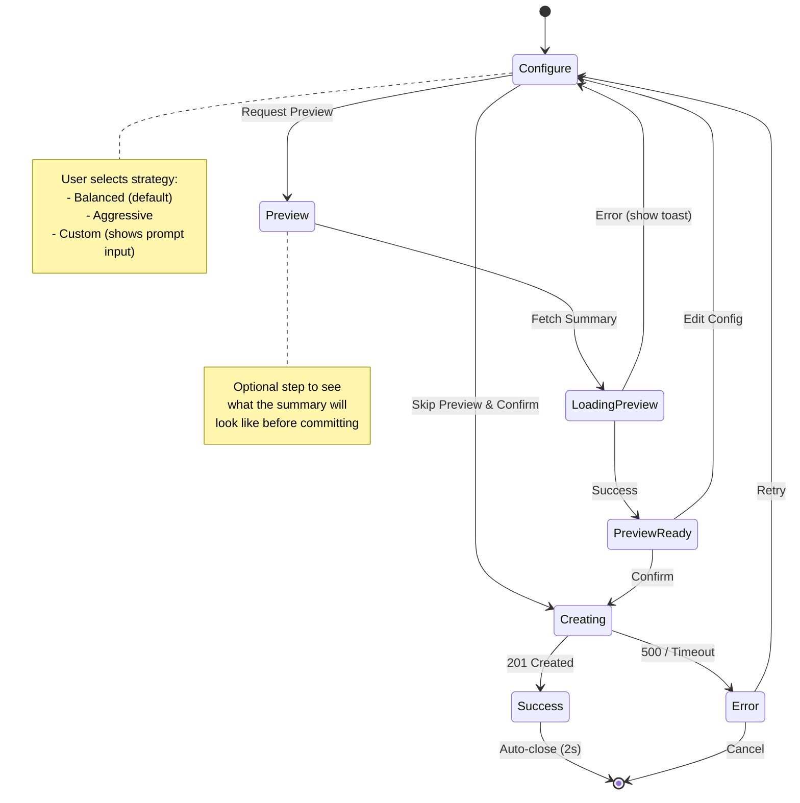
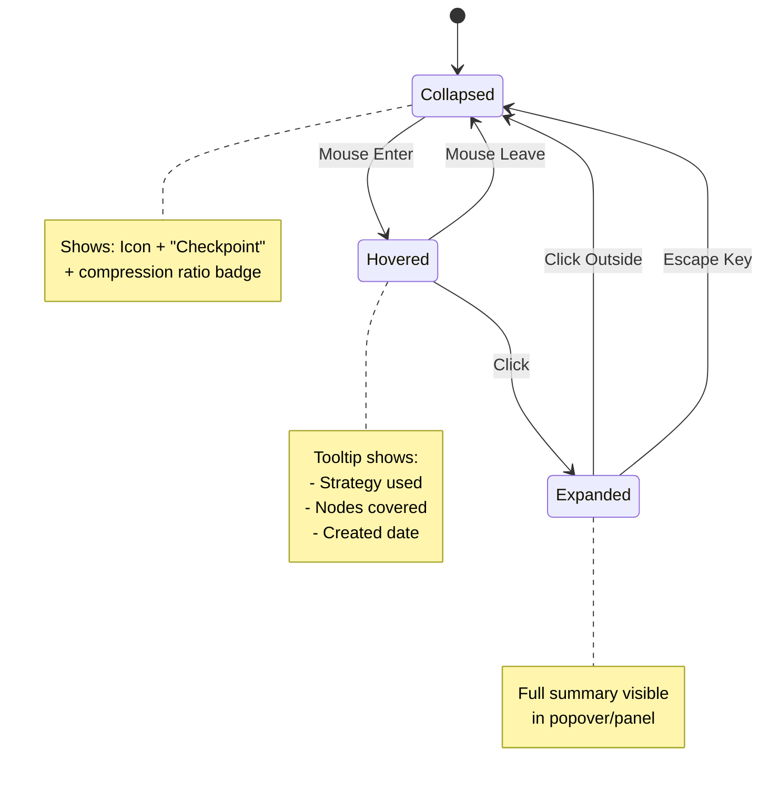
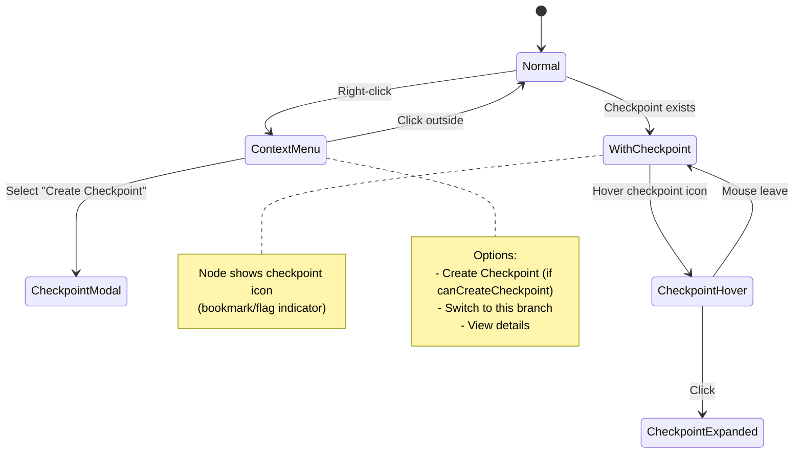
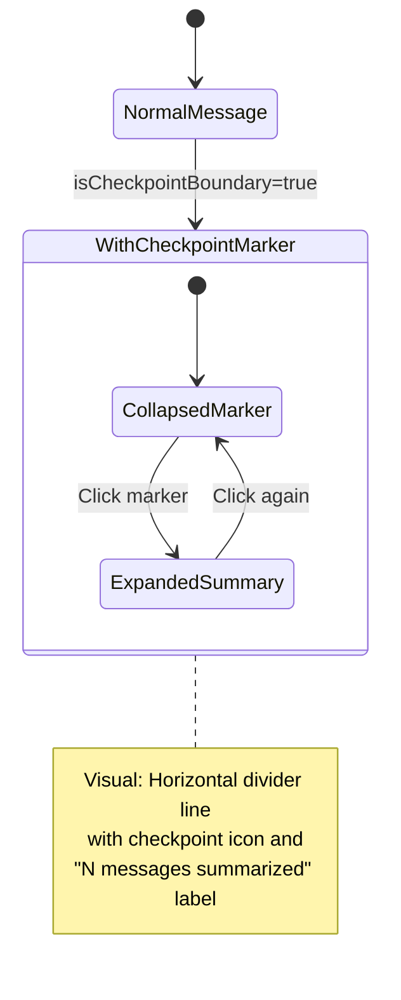

# Checkpoint Creation UI Specification

## Overview

This specification covers the UI components for creating conversation checkpoints. A checkpoint compacts all parent nodes from the current position up to the root (or previous checkpoint) into a summary, reducing context size while preserving essential information.

---

## Component 1: CheckpointCreationModal

### 1.1 Component Contract

```typescript
/** Compression strategy for checkpoint creation */
type CompressionStrategy =
  | 'balanced'      // Keep facts, constraints, decisions and reasoning
  | 'aggressive'    // Remove all non-essential content, including tool calls
  | 'custom';       // User-provided prompt guides compression

interface CheckpointCreationModalProps {
  // [Controlled] Whether the modal is open
  isOpen: boolean;
  // [Controlled] Session ID for the checkpoint
  sessionId: string;
  // [Controlled] Node ID where checkpoint will be created
  targetNodeId: string;
  // [Computed] Number of nodes that will be compacted
  nodeCount: number;
  // [Computed] Estimated token count of nodes to compact
  estimatedTokens: number;
  // [Controlled] Whether a previous checkpoint exists in the path
  hasPreviousCheckpoint: boolean;
  // [Controlled] Callback when modal should close
  onClose: () => void;
  // [Controlled] Callback when checkpoint is created
  onCheckpointCreated: (checkpointId: string) => void;
}

interface CheckpointCreationModalState {
  // [Local] Currently selected compression strategy
  strategy: CompressionStrategy;
  // [Local] Custom prompt text (only used when strategy === 'custom')
  customPrompt: string;
  // [Local] Current modal step
  step: 'configure' | 'preview' | 'creating' | 'success' | 'error';
  // [Local] Preview of the generated summary (fetched from backend)
  summaryPreview: string | null;
  // [Local] Error message if creation fails
  errorMessage: string | null;
}

interface CheckpointCreationModalEvents {
  // Called when user confirms checkpoint creation
  onConfirm: (config: {
    strategy: CompressionStrategy;
    customPrompt?: string;
  }) => Promise<void>;
  // Called when user requests summary preview
  onPreviewRequest: (config: {
    strategy: CompressionStrategy;
    customPrompt?: string;
  }) => Promise<string>;
}
```

### 1.2 State Logic



### 1.3 Behavioral Scenarios

- **Scenario: Default Strategy Selection**
  - **Given** the modal opens
  - **When** user does not change any settings
  - **Then** "Balanced" strategy should be pre-selected as default

- **Scenario: Custom Prompt Validation**
  - **Given** user selects "Custom" strategy
  - **When** custom prompt field is empty
  - **Then** "Create Checkpoint" button should be disabled with tooltip "Enter a prompt"

- **Scenario: Preview Generation Timeout**
  - **Given** user clicks "Preview Summary"
  - **When** backend takes > 30s to respond
  - **Then** show timeout error and return to Configure step, preserving user inputs

- **Scenario: Concurrent Checkpoint Prevention**
  - **Given** a checkpoint creation is in progress (Creating state)
  - **When** user tries to close modal or navigate away
  - **Then** show confirmation dialog "Checkpoint creation in progress. Cancel?"

- **Scenario: Empty Node Range**
  - **Given** targetNodeId is the same as previous checkpoint or root
  - **When** modal attempts to open
  - **Then** show error "No messages to checkpoint" and prevent modal from opening

---

## Component 2: CheckpointBadge (Enhanced)

### 2.1 Component Contract

```typescript
interface CheckpointBadgeProps {
  // [Controlled] The checkpoint data
  checkpoint: {
    nodeId: string;
    summary: string;
    strategy: CompressionStrategy;
    createdAt: Date;
    stats: {
      nodesCovered: number;
      originalTokens: number;
      compressedTokens: number;
    };
  };
  // [Controlled] Whether this checkpoint is on the active path
  isActive: boolean;
  // [Local] Whether summary is expanded
  isExpanded?: boolean;
  // [Controlled] Callback when user wants to view full summary
  onExpand?: () => void;
  // [Controlled] Callback when user wants to restore to this checkpoint
  onRestore?: () => void;
}

interface CheckpointBadgeState {
  // [Local] Hover state for tooltip
  isHovered: boolean;
  // [Local] Whether full summary is shown
  showFullSummary: boolean;
}

interface CheckpointBadgeEvents {
  onClick: () => void;
  onDoubleClick: () => void;
}
```

### 2.2 State Logic



### 2.3 Behavioral Scenarios

- **Scenario: Compression Ratio Display**
  - **Given** checkpoint has originalTokens=5000, compressedTokens=500
  - **When** badge is rendered
  - **Then** show "90% reduced" or "10x compressed" indicator

- **Scenario: Strategy Indicator**
  - **Given** checkpoint was created with "aggressive" strategy
  - **When** user hovers over badge
  - **Then** tooltip should show warning icon with "Aggressive compression - some details may be lost"

---

## Component 3: TreeNode (Enhanced for Checkpoint)

### 3.1 Component Contract

```typescript
interface TreeNodeProps {
  // ... existing props ...

  // [Controlled] Whether this node has a checkpoint
  hasCheckpoint: boolean;
  // [Controlled] Checkpoint data if exists
  checkpointData?: {
    summary: string;
    strategy: CompressionStrategy;
    nodesCovered: number;
  };
  // [Controlled] Whether checkpoint creation is allowed at this node
  canCreateCheckpoint: boolean;
  // [Controlled] Callback to initiate checkpoint creation
  onCreateCheckpoint?: () => void;
}
```

### 3.2 Visual States



---

## Component 4: MessageCard (Enhanced for Checkpoint)

### 4.1 Component Contract

```typescript
interface MessageCardProps {
  // ... existing props ...

  // [Controlled] Whether this message is at a checkpoint boundary
  isCheckpointBoundary: boolean;
  // [Controlled] Checkpoint info if this is a boundary
  checkpoint?: {
    id: string;
    summary: string;
    strategy: CompressionStrategy;
    createdAt: Date;
  };
  // [Controlled] Whether user can create checkpoint after this message
  canCreateCheckpointHere: boolean;
  // [Controlled] Callback to open checkpoint creation modal
  onCreateCheckpoint?: () => void;
}
```

### 4.2 Checkpoint Boundary Display



### 4.3 Behavioral Scenarios

- **Scenario: Checkpoint Boundary Rendering**
  - **Given** message is marked as checkpoint boundary
  - **When** message card renders
  - **Then** show visual separator ABOVE the message with checkpoint summary preview

- **Scenario: Create Checkpoint Action**
  - **Given** user right-clicks on a message card
  - **When** "Create Checkpoint Here" is selected
  - **Then** open CheckpointCreationModal with targetNodeId set to this message's node

---

## API Integration

### Endpoints Implemented

```typescript
/** Compression strategy for checkpoint creation */
type CompressionStrategy = 'balanced' | 'aggressive' | 'custom';

// POST /api/sessions/:sessionId/checkpoints
// Creates a checkpoint and persists it to the session
interface CreateCheckpointRequest {
  target_node_id: string;
  strategy?: CompressionStrategy;       // Default: 'balanced'
  custom_prompt?: string;               // Required when strategy === 'custom'
  use_main_provider?: boolean;          // Default: false (uses quick provider)
}

interface CreateCheckpointResponse {
  checkpoint_id: string;
  summary: string;
  stats: {
    nodes_covered: number;
    original_tokens: number;
    summary_tokens: number;
    compression_ratio: number;          // e.g., 0.1 means 90% reduction
  };
}

// POST /api/sessions/:sessionId/checkpoints/preview
// Generates a preview without persisting (same request/response structure)
interface PreviewCheckpointRequest {
  target_node_id: string;
  strategy?: CompressionStrategy;       // Default: 'balanced'
  custom_prompt?: string;               // Required when strategy === 'custom'
  use_main_provider?: boolean;          // Default: false (uses quick provider)
}

interface PreviewCheckpointResponse {
  checkpoint_id: string;                // Will be empty string for preview
  summary: string;
  stats: {
    nodes_covered: number;
    original_tokens: number;
    summary_tokens: number;
    compression_ratio: number;
  };
}
```

### Provider Selection

By default, checkpoint operations use the **quick provider** (configured via `system_profiles.quick` in config.yaml) for cost and speed efficiency. Users can opt to use the main session provider by setting `use_main_provider: true` for higher quality summaries.

---

## Compression Strategy Prompts (Backend Implementation)

### Balanced (Default)
```
Summarize the following conversation, preserving:
- Key facts and data points established
- Constraints and requirements identified
- Decisions made and their reasoning
- Current state and next steps

Remove:
- Casual conversation and greetings
- Repeated information
- Verbose explanations (keep conclusions only)

Output a concise summary that allows the conversation to continue naturally.
```

### Aggressive
```
Create a minimal summary containing ONLY:
- Final decisions and outcomes
- Critical constraints that affect future actions
- Current objective/goal

Remove ALL:
- Tool calls and their results (summarize outcomes only in one sentence)
- Reasoning and deliberation
- Alternative options that were rejected
- Any content not directly relevant to the main goal

Be extremely concise. The summary should be as short as possible while preserving the ability to continue the conversation.
```

### Custom
```
You are summarizing a conversation between a user and an AI assistant.
The summary will replace the original messages to reduce context size.
Ensure the summary preserves enough information for the conversation to continue coherently.

User's compression instructions:
[User-provided prompt]
```

---

## Implementation Priority

1. **Phase 1**: CheckpointCreationModal with basic strategies
2. **Phase 2**: Preview functionality
3. **Phase 3**: Enhanced MessageCard with checkpoint boundaries
4. **Phase 4**: Enhanced TreeNode with checkpoint visualization
5. **Phase 5**: CheckpointBadge with stats and expansion
